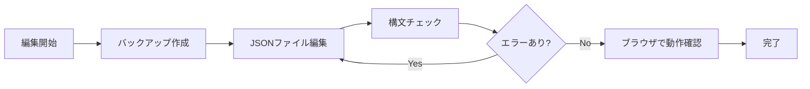

# EV Prime 投資先共有用

投資先企業向けの特典・サービス検索システム

## 📁 プロジェクト構成

```
src/
├── assets/                  # 静的アセット
│   ├── css/
│   │   └── style.css       # メインスタイルシート（レスポンシブ対応）
│   └── js/
│       └── script.js       # メインJavaScript（検索/フィルタリング機能）
├── data/                   # データファイル（JSONフォーマット）
│   ├── companies.json      # 企業データベース
│   └── popular.json        # 人気企業リスト
├── index.html              # メインHTMLファイル
└── robots.txt              # 検索エンジン制御ファイル
README.md
```

## 🔧 データ管理完全ガイド

### 📂 データファイルの詳細

#### 1. 企業データベース（companies.json）
- **場所**: [`src/data/companies.json`](src/data/companies.json)
- **形式**: JSON配列形式
- **文字コード**: UTF-8（必須）
- **バックアップ**: 編集前に必ずバックアップを取ることを推奨

#### 2. 人気企業リスト（popular.json）
- **場所**: [`src/data/popular.json`](src/data/popular.json)
- **形式**: 文字列の配列

### 📊 データ構造の詳細仕様

#### 企業データのフィールド仕様

```json
{
  "company_name": "株式会社サンプル",      // 【必須】企業名（正式名称）
  "email": "contact@sample.co.jp",        // 【推奨】お問い合わせメールアドレス
  "company_logo": "https://example.com/logo.png",  // 【任意】企業ロゴURL（推奨サイズ：400x400px）
  
  "application_info": {                   // 【推奨】申請情報
    "method": "email",                    // 申請方法（"email" or "form" or "phone"）
    "details": "申請時に「EV Prime特典」と記載" // 申請手順の詳細（改行は\nを使用）
  },
  
  "contact_name": "山田 太郎",            // 【任意】担当者名
  "contact_email": "yamada@sample.co.jp", // 【任意】担当者直通メール
  
  "sponsorship_conditions": [             // 【推奨】提供条件の配列
    {
      "condition": "全社導入可能",        // 条件タイプ（定型文を使用）
      "note": "従業員100名まで"          // 条件の補足説明
    }
  ],
  
  "company_wide_plan": {                  // 【推奨】全社向けプラン
    "summary": "特典内容の詳細説明",      // プラン概要（改行は\nを使用）
    "features": [                        // 【任意】特典リスト
      "月額50%OFF",
      "初期費用無料",
      "専任サポート付き"
    ]
  },
  
  "ev_prime_plan": {                      // 【任意】EV Prime限定プラン
    "summary": "EV Prime投資先限定の特別プラン内容"
  },
  
  "other_references": [                   // 【任意】参考リンク
    "https://sample.co.jp/evprime-plan",
    "https://docs.sample.co.jp/guide"
  ],
  
  "tags": [                               // 【必須】カテゴリタグ（検索・フィルタ用）
    "SaaS",
    "HR",
    "Cloud"
  ]
}
```

### 🏷️ タグシステムの管理

#### 標準タグカテゴリ一覧

| カテゴリ | タグ例 | 用途 |
|---------|--------|------|
| **技術系** | `"SaaS"`, `"API"`, `"Cloud"`, `"AI"`, `"Development"`, `"Infrastructure"` | 技術サービスの分類 |
| **ビジネス系** | `"HR"`, `"Finance"`, `"Marketing"`, `"Sales"`, `"Accounting"` | ビジネス機能別分類 |
| **業界系** | `"FinTech"`, `"EdTech"`, `"HealthTech"`, `"LegalTech"` | 業界特化型サービス |
| **サービス形態** | `"Consulting"`, `"Software"`, `"Platform"`, `"Tool"` | 提供形態の分類 |
| **その他** | `"Office"`, `"Education"`, `"Analytics"`, `"Mobile"`, `"Security"` | その他の分類 |

#### タグ付けのベストプラクティス
- **最小2個、最大5個**のタグを設定
- **既存タグを優先**して使用（一貫性のため）
- 新規タグは**英語表記**で統一
- **頭文字は大文字**（例：`"Marketing"`）

### 🔥 人気企業リストの詳細管理

#### popular.json の仕組み

```javascript
// src/assets/js/script.js での処理フロー
1. popular.json を読み込み
2. 各企業名を小文字化・トリミング処理
3. companies.json の company_name と照合
4. 一致した企業に「人気」フラグを付与
5. 表示時に上位に配置 + バッジ表示
```

#### 設定手順

1. **企業名を追加/削除**
   ```json
   [
     "AWS",                      // サービス名でもOK
     "株式会社SmartHR",          // 正式名称推奨
     "Stripe",
     "PAY株式会社"
   ]
   ```

2. **注意事項**
   - 企業名は**companies.json内のcompany_nameと完全一致**が必要
   - 大文字小文字は区別されない（`"aws"` = `"AWS"`）
   - 前後の空白は自動除去される

### 🆕 企業データの追加手順（詳細版）

#### STEP 1: データ準備
必要な情報を事前に収集：
- ✅ 企業名（正式名称）
- ✅ 連絡先メールアドレス
- ✅ 特典内容の詳細
- ✅ 申請方法
- ✅ カテゴリ（タグ）
- ⭕ 企業ロゴURL（任意）
- ⭕ 担当者情報（任意）

#### STEP 2: JSONへの追加

1. **companies.json を開く**
   ```bash
   # VSCodeで開く場合
   code src/data/companies.json
   ```

2. **配列の最後に追加**
   ```json
   [
     {
       "company_name": "既存企業A",
       ...
     },
     {
       "company_name": "既存企業B",
       ...
     },  // ← カンマを忘れずに！
     {
       "company_name": "新規追加企業",
       "email": "contact@newcompany.jp",
       "tags": ["SaaS", "Marketing"],
       "company_wide_plan": {
         "summary": "初年度50%割引\\n専任サポート付き"
       }
     }
   ]
   ```

#### STEP 3: 構文チェック

1. **オンラインバリデーター使用**
   - [JSONLint](https://jsonlint.com/) にコピー&ペースト
   - 「Validate JSON」をクリック
   - エラーがあれば修正

2. **コマンドラインでの確認**（Node.js環境）
   ```bash
   node -e "console.log(JSON.parse(require('fs').readFileSync('src/data/companies.json', 'utf8')).length + ' companies loaded')"
   ```

#### STEP 4: 動作確認

1. **ブラウザで確認**
   - `src/index.html` をブラウザで開く
   - キャッシュクリア（Cmd/Ctrl + Shift + R）
   - 検索ボックスに企業名を入力して確認

2. **開発者ツールでエラーチェック**
   - F12キーで開発者ツールを開く
   - Consoleタブでエラーがないか確認

### ✏️ 既存データの編集ガイド

#### 安全な編集フロー



#### よくある編集パターン

##### 1. 特典内容の更新
```json
// Before
"company_wide_plan": {
  "summary": "30%割引"
}

// After
"company_wide_plan": {
  "summary": "50%割引\\n初期費用無料\\n※2025年12月末まで"
}
```

##### 2. タグの追加
```json
// Before
"tags": ["SaaS"]

// After
"tags": ["SaaS", "AI", "Analytics"]
```

##### 3. ロゴURLの追加
```json
// Before
"company_logo": null

// After
"company_logo": "https://example.com/logo.png"
```

### 🗑️ データ削除の安全な手順

1. **バックアップ作成**
   ```bash
   cp src/data/companies.json src/data/companies.backup.json
   ```

2. **該当企業を特定**
   - 企業名で検索（Cmd/Ctrl + F）
   - オブジェクト全体を選択（`{` から `}` まで）

3. **削除実行**
   ```json
   [
     {
       "company_name": "企業A"
     },
     // ← この企業を削除する場合
     {
       "company_name": "削除対象企業"
     },
     // ← カンマも忘れずに削除
     {
       "company_name": "企業C"
     }
   ]
   ```

4. **削除後の確認**
   - 前後のカンマが正しいか確認
   - JSONバリデーターでチェック
   - ブラウザで動作確認

### ⚠️ トラブルシューティング

#### よくあるエラーと対処法

| エラー内容 | 原因 | 解決方法 |
|-----------|------|----------|
| **「データの読み込みに失敗しました」** | JSON構文エラー | JSONLintで構文チェック |
| **企業が表示されない** | 必須フィールド不足 | `company_name`が設定されているか確認 |
| **検索で見つからない** | インデックス未更新 | ページを完全リロード（Ctrl+Shift+R） |
| **タグフィルターに出ない** | タグのスペルミス | 既存タグと表記を統一 |
| **人気バッジが出ない** | 企業名の不一致 | popular.jsonとcompany_nameを完全一致させる |
| **ロゴが表示されない** | URL不正/CORS | HTTPSのURLを使用、CORS対応確認 |

#### デバッグ用コンソールコマンド

```javascript
// ブラウザのコンソールで実行

// 全企業数を確認
console.log(`企業数: ${allCompanies.length}`);

// タグ一覧を確認
console.log('タグ一覧:', Array.from(allTags).sort());

// 人気企業を確認
console.log('人気企業:', Array.from(popularNames));

// 特定企業のデータを確認
allCompanies.find(c => c.company_name.includes('検索したい企業名'))
```

### 📋 データテンプレート集

#### 最小構成（必須項目のみ）
```json
{
  "company_name": "株式会社〇〇",
  "tags": ["SaaS"]
}
```

#### 標準構成（推奨）
```json
{
  "company_name": "株式会社〇〇",
  "email": "contact@example.co.jp",
  "tags": ["SaaS", "HR"],
  "company_wide_plan": {
    "summary": "特典内容をここに記載"
  },
  "sponsorship_conditions": [
    {
      "condition": "全社導入可能",
      "note": null
    }
  ]
}
```

#### フル構成（全項目）
```json
{
  "company_name": "株式会社〇〇",
  "email": "contact@example.co.jp",
  "company_logo": "https://example.com/logo.png",
  "application_info": {
    "method": "email",
    "details": "申請時に「EV Prime特典希望」と記載\\n担当者より24時間以内に返信"
  },
  "contact_name": "山田 太郎",
  "contact_email": "yamada@example.co.jp",
  "sponsorship_conditions": [
    {
      "condition": "全社導入可能",
      "note": "従業員数100名まで"
    },
    {
      "condition": "EV Primeの条件に該当する企業に対して導入",
      "note": "要審査"
    }
  ],
  "company_wide_plan": {
    "summary": "【特典内容】\\n・初年度50%割引\\n・初期設定費用無料\\n・専任カスタマーサクセス付与\\n\\n【適用条件】\\n・新規契約のみ\\n・年間契約必須",
    "features": [
      "50%割引",
      "初期費用無料",
      "優先サポート"
    ]
  },
  "ev_prime_plan": {
    "summary": "EV Prime投資先限定で70%割引"
  },
  "other_references": [
    "https://example.com/evprime-plan",
    "https://docs.example.com/setup-guide"
  ],
  "tags": ["SaaS", "HR", "Cloud", "AI"]
}
```


## 🚀 システムアーキテクチャ

### 技術スタック

| レイヤー | 技術 | 用途 |
|---------|------|------|
| **フロントエンド** | HTML5, CSS3, JavaScript (ES6+) | UIレンダリング |
| **UIフレームワーク** | Bootstrap 5.3.0 | レスポンシブデザイン |
| **アイコン** | Bootstrap Icons 1.11.0 | UI要素のアイコン |
| **データフォーマット** | JSON | 企業データの管理 |
| **ストレージ** | LocalStorage | お気に入り・テーマ設定の保存 |


---

最終更新日: 2025年8月12日